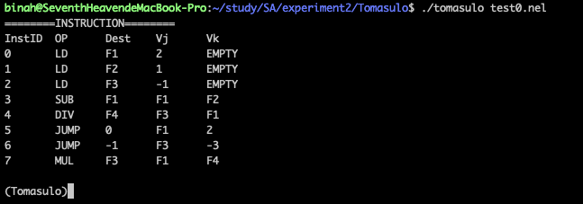
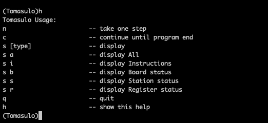
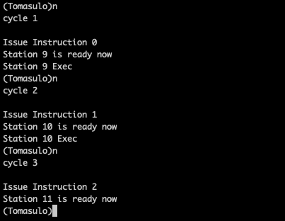
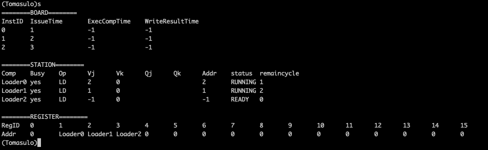
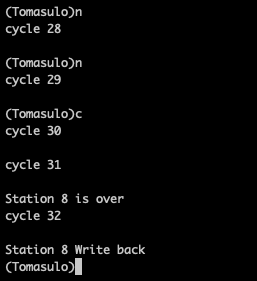
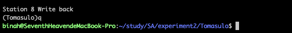
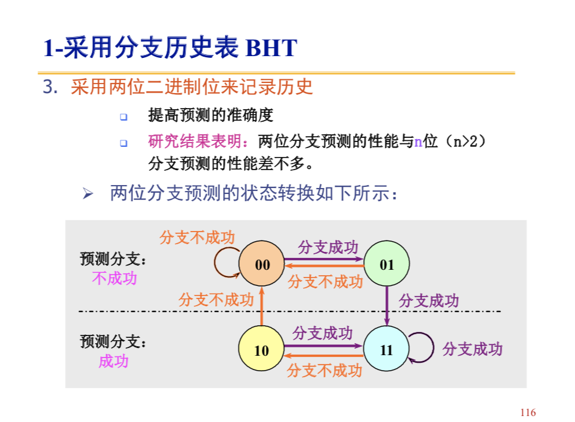
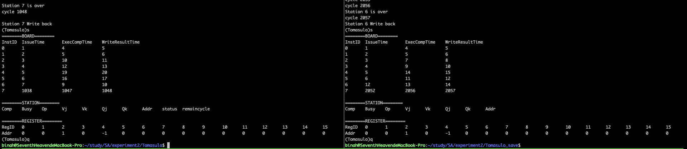

<strong>计算机系统结构实验二-Tomasulo算法模拟器 Report</strong>

计62 胡致远 2016011260

### 设计思路

---------------

模拟器的设计思路是维护一个station,一个board，一个寄存器组用来记录算法当前运行的状态，然后根据tomasulo算法中描述的四个阶段反复运行，直到station中没有处于busy的组件且所有下一条需要issue的指令id为总指令数+1

tomasulo算法中四个过程的执行顺序为：

> WriteBack
>
> Issue
>
> Update/Exec
>
> Check ready for exec

### 编译与执行方法

----------------------

执行make执行可以进行编译，执行 ./tomasulo InputFileName可以运行程序

### 简易的交互界面

-------------------

为了方便用户运行程序，设计了类似GDB的简易交互界面

算法启动后，将读取文件并显示指令，然后进入交互界面，如下：

执行h可以查看交互界面帮助：

执行n可以运行一步(前进一个时钟)：

执行s可以显示station,board和regsiter的信息(为了显示方便寄存器个数设置为了16个)：

执行c可以连续执行直到程序结束：

执行q可以退出程序：

### 分支预测

-----------------------

在本程序中实现了基于历史的分支预测，具体原理参照了课件：

即使用两位二进制位来记录每条指令对应的分支历史，然后根据指令的历史决定预测的结果

对于预测失败时状态的复原，采用如下方法：

在每次Issue Jump指令时，将全局的状态(status)保存下来，由于可能同时有多个Jump指令正在运行，需要将这些status组织成一个链表，当一条Jump指令写回时，如果发现预测失败，则将对应的status中全局的状态恢复即可。

### 分支预测的实验结果

-----------------------

为了检测上述分支预测算法的合理性，在test0.nel的基础上编写了一个简单的程序，主要完成的任务是进行1600次循环，该nel程序的代码如下：

> LD,F1,0x100
> LD,F2,0x1
> LD,F3,0xFFFFFFFF
> SUB,F1,F1,F2
> DIV,F4,F3,F1
> JUMP,0x0,F1,0x2
> JUMP,0xFFFFFFFF,F3,0xFFFFFFFD
> MUL,F3,F1,F4

分别使用带分支预测的版本(左侧程序)和不带分支预测的版本(右侧程序)执行，结果如下(为了显示方便，寄存器个数设置为16个)：

可以看出，不带分支预测时，整个程序运行了2057个周期才结束，而加上分支预测后，程序只运行了1048个周期，性能提升了96.27%，可见我们设计的分支预测算法是正确的。